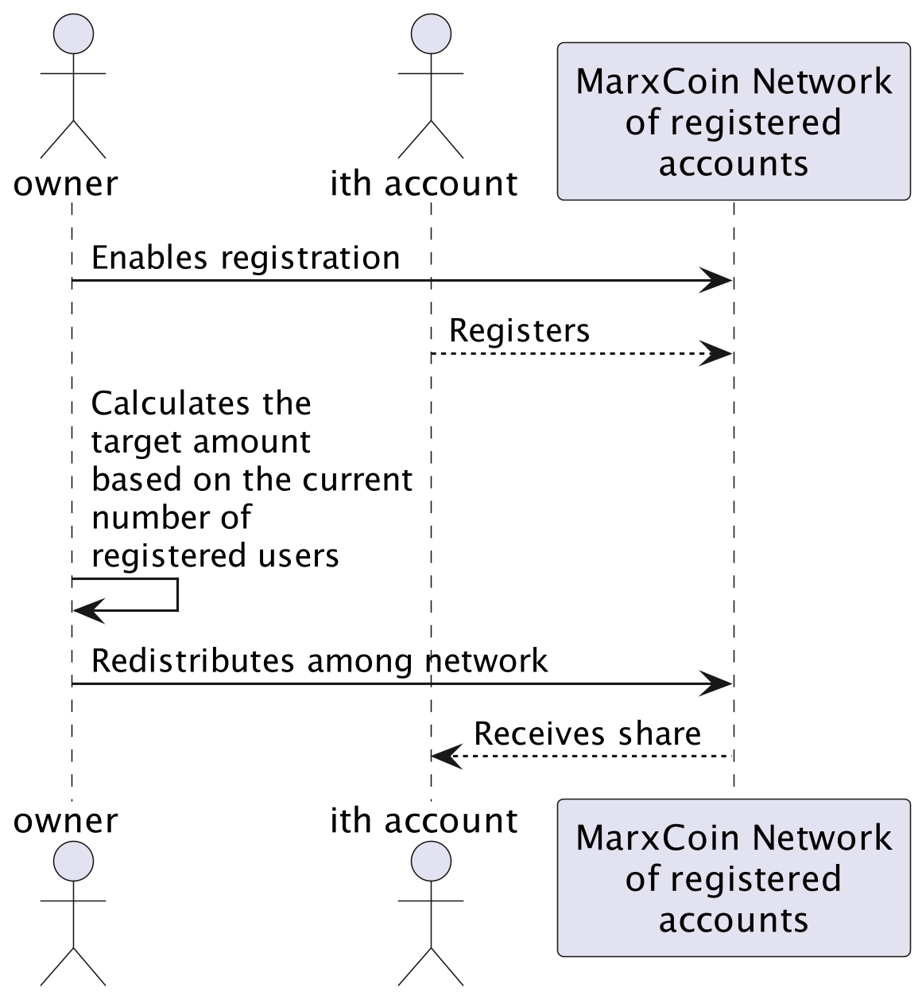
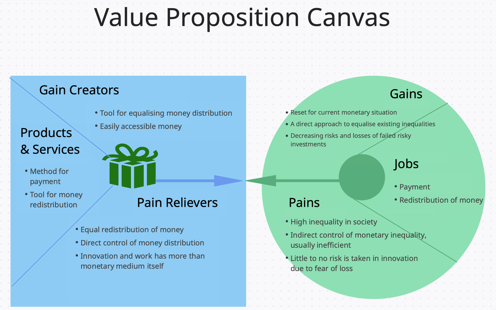

# Tokenomics


## Why MarxCoin?

MarxCoin is a coin that implements socialist and democratic ideas to provide a group of users with the same amount of monetary resources and that aims at achieving an equally distributed money proposition among all users.
This is achieved by a redistribution function that currently is controlled by one central organization. This way after a predefined time period, redistribution is possible.
Knowing this, users are incentivized to incur debt, invest and in general spend money more generously than with a system where doing these things can lead to imminent financial insolvency.
People are given the opportunity to participate in a network that does not allow for steep inequality among the network's users.

## Value Proposition Canvas


## Token Design

### Initial Supply and Max Supply

#### Options

- 2.8 billion (according to ChatGPT that was the value of rubles in US dollar)
- 18830314, Death date of Karl Marx
- equal to circulating supply
- 19911226, Perestroika and end of Soviet Union
- equal to ciculating supply 1 billion

### Circulating Supply

- How much in the market at given moment in time
- Circulating supply affects supply and demand most
- If circulating supply is much less than max supply then inflation can occur
- Ethereum does not have inflation, even though it is uncapped

### Minting Strategy

- No mint

## Constructor Attributes for Token 

- "MarxCoin",
- "MARX",
- 18,
- 1000000000000000000000000000000 == 1_000_000_000_000_000_000_000_000_000_000 ^= 1 Billion Ether

## How is money redistributed?

### Distribute tokens to registered accounts

```
@startuml
skinparam dpi 300

actor owner as o
actor "ith account" as acc
participant "MarxCoin Network\nof registered\naccounts" as mc

o -> mc : Enables registration
acc --> mc : Registers
o -> o : Calculates the\ntarget amount\nbased on the current\nnumber of\nregistered users
o -> mc : Redistributes among network
mc --> acc : Receives share
@enduml
```


## Value Proposition Canvas





## Outlook

To make this contract a viable consideration for everyday use one could:
- Implement a restore function that enables the central entity to burn an account if the user has lost his credentials and mint the same amount the user has lost and provide him with a new account.
- Think of ways to remove the central entity, for example based on a governance token that controls the central entitiy and that is similarly implemented in democratic fashion so that every user has a right to vote.


